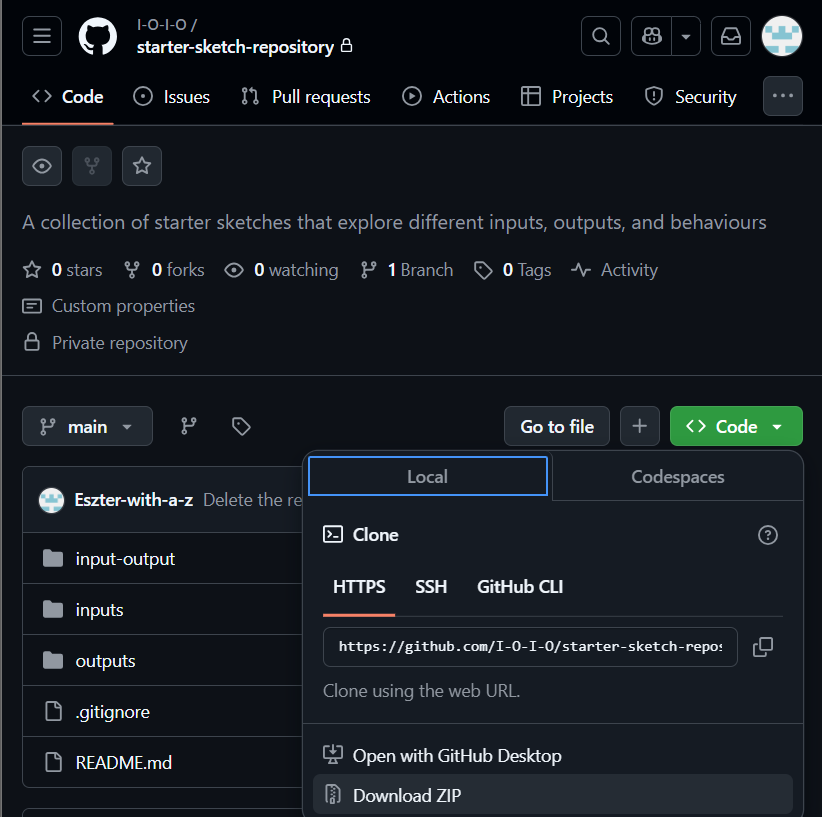

# Workflow
Here is out process of creating sketches!

**Disclaimer:** it was a fuzzy process so not all our sketches follow the conventions we mention here. Rather, the recommended conventions are the outcomes of the process of creating all these sketches.

**Good to know**: Overall, when you make a new card, you create 3 sketches: 1 input sketch, 1 output sketch, 1 input-output sketch.

The process includes 3 main steps:
1. Prepare!
2. Implement!
3. Finalize!
# Prepare
## 1.0. Print the shelf
> Physical

If the current shelves are filled with prototypes, (first of all, great job!) you can always print more shelves. Grab the following files and lasercut them in the workshop!

File path: xx/xx/xx

Make sure to print not only the shelf but also the cards to put the samples on!
Glue them with wood glue!

## 1.1. Choose the input and the output COMPONENTS
Time to get started with a sketch!
First of all:
* Look at your feedback from the students/inventory to understand which inputs and outputs are the most needed!
* Choose an arbitrary (but feasible) combination an INPUT and an OUTPUT! (e.g. Input: capacitive sensore, Output: buzzer)

## 1.2. Choose the input and the output BEHAVIOR
* Plan what kind of **input-output** behavior you want to achieve!
* Divide it into input and output sketch

There you go, now you have the plan for the 3 sketches!

TIPP: **Make it modular!** 
Our principle was to choose the components and the behavior so that the input-output sketch is the combination of the input sketch and the output sketch.
> E.g.: CapacitiveSensor_to_Serial (INPUT) prints the value of a capacitive sensor to the serial, whereas Code_to_Buzzer (OUTPUT) buzzes for 1 sec, then stops, then repeats.

>Therefore, adding the 2 together, CapacitiveSensor_to_Buzzer takes the number that the input sketch printed on serial and the higher the number is the faster the buzzer buzzes.

**So the input-output sketch is just adding the two sketches together.**

 Sounds obvious but it saves a lot of time and is more comprehensive for the students to look at the code as a result of building blocks!

 ## 1.3. Prepare the parts!
 > Physical

* Take a card from the shelf!

* Add the breadboard with an Arduino Nano BLE 33!

* Add the input and the output components to the card!

Until finalizing it, just use häftmassa to stick the components to the card. Also, a general recommendation is to put the output component to the outer part of the card so that the other components don't overlap with its sensor.
 > Digital

We store all the documentation in the [GitHub repository](https://github.com/I-O-I-O/starter-sketch-repository/tree/main), so make sure to download it! Once you have your local copy, you can start creating the sketch!🥳

# 2. Implement!
The following steps are creating the input, output and input-output sketch. They inlcude the same steps with slight modifications.
### 2.1. Create the file!
Once you have your own version of the libary, create your own file in the respective folder: 
| Sketch  | File Path | Naming Convention|
| ------------- |:-------------:|:-------------:|
| Input     | ..\inputs   | INPUT_to_Serial.ino|
| Output     | ..\outputs     | Code_to_OUTPUT.ino
|Input-Output      | ..\input-output     | INPUT_to_OUTPUT.ino|

### 2.2. Write the code!
Write the code from the top of your head or by using other sources like stackoverflow or some AI! But don't forget to <ins>credit your sources</ins>! 

**For readability for the students, inlcude some explanation of the code as comments in the beginning!**

**Use this template, and adjust as needed: 
[for-curators\Input_to_Output_Template](.\Input_to_Output_Template)**
### 2.3. Test!
### 2.4. Create the wiring!
Once you are sure your code works as expected, and is readible, time to create the wiring!

* Use Fritzing!
* In the Fritzing Wiring, try to make it as close to the physical wiring as possible!

Tipp: to get the Arduino Nano Ble 33 as a Fritzing components, go to the [component's offical page](https://store.arduino.cc/en-se/products/arduino-nano-33-ble?srsltid=AfmBOorG4zY1tAB2yFRSZ2TF11vL5tJmOjZdceUpj33mfkVZKr7Nc4AR)>Documentation>Fritzing IN FZPZ
* Save it as:

| Name  | Folder | Format |
| ------------- |:-------------:|:-------------:|
| WIRING_name_of_sketch    | same as the .ino file  | JPG (arbitrary just for the sake of consitency)|

### 2.5. Publish it!
Once you have the 
* folder for the sketch
    *   .ino file
    * JPG wiring
    * optional video of expected behavior,

You are ready to commit to the main folder to make it available to everone! Good job!🎉

# Finalize!
 ## 3.1. Additional refining
 Once you have both the **physical** and **digital sketch**, you might want to glue the components to the card (except the microcontroller!), as well, as print the wiring and glue it on the bottom of the card!

 > **Print the name of the sketch (same as .ino file) and glue it on the card!**

 Add it to the library! Well done!
 ## 3.2. Get a feedback!
 Don't forget to ask for feedback from students about any aspect of the project: how usable is the code? what is missing? how hard is it to find a sketch?

 Keep track of these feedbacks as they can guide you in choosing the next sketch to implement!
 
 Happy coding!